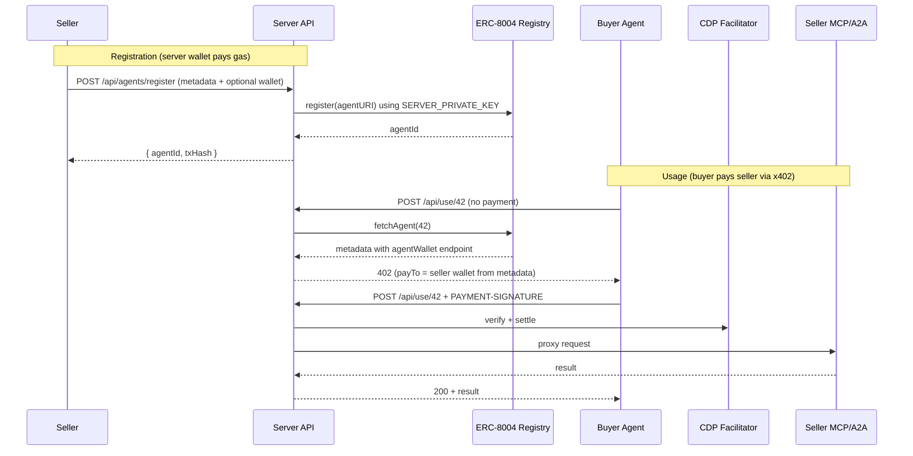

# Refactor: Server-Managed Agent Registration

## Architecture




Key design decisions:

- **Server wallet** pays all on-chain gas for `register()`. Configured via `SERVER_PRIVATE_KEY` env var.
- **On-chain owner** of registered agents is the server wallet (since it calls `register()`).
- **Seller wallet** is stored inside the agent metadata as an `agentWallet` endpoint entry (per the ERC-8004 convention the user showed). This is optional; if the seller does not provide one, x402 `payTo` falls back to the server wallet.
- **x402 payTo** resolution order: metadata `agentWallet` endpoint -> on-chain `owner`.
- **Network**: Filecoin Calibration (`filecoinCalibration`) for testnet, using the identity registry at `0xa450345b850088f68b8982c57fe987124533e194`.

## Files to Create

### 1. `site/lib/server-wallet.ts` -- Server wallet client

Creates a viem wallet client from `SERVER_PRIVATE_KEY` env var. Used by the registration endpoint to sign and send transactions. Also exports the `register` ABI for the IdentityRegistry contract.

Key exports:

- `getServerWalletClient()` -- returns a viem `WalletClient` on Filecoin Calibration
- `getServerAccount()` -- returns the `Account` from `privateKeyToAccount`
- `IDENTITY_REGISTER_ABI` -- `[{ name: "register", inputs: [{ name: "agentURI", type: "string" }], outputs: [{ name: "agentId", type: "uint256" }], stateMutability: "nonpayable", type: "function" }]`

### 2. `site/app/api/agents/register/route.ts` -- Registration endpoint

`POST /api/agents/register`

Accepts JSON body:

```typescript
{
  name: string;
  description: string;
  image?: string;
  mcpEndpoint?: string;
  mcpTools?: Array<{ name: string; description?: string }>;
  a2aEndpoint?: string;
  sellerWallet?: string;    // optional EVM address for receiving payments
  network?: NetworkId;       // defaults to "filecoinCalibration"
}
```

Logic:

1. Validate required fields (`name`, `description`, at least one of `mcpEndpoint` or `a2aEndpoint`).
2. Build the ERC-8004 registration-v1 JSON with `endpoints[]` array containing MCP/A2A entries and optionally an `agentWallet` entry if `sellerWallet` is provided.
3. Encode as `data:application/json;base64,...` URI.
4. Call `register(agentURI)` on the IdentityRegistry using the server wallet.
5. Wait for transaction receipt, extract `agentId` from Transfer event logs.
6. Return `{ success: true, agentId, txHash, network }`.

### 3. `site/app/api/agents/list/route.ts` -- List agents endpoint (thin wrapper)

`GET /api/agents/list` -- same as existing `GET /api/agents` but explicitly named. The existing `/api/agents` route already works for this. This is optional and can be skipped if the existing route suffices.

## Files to Modify

### 4. `site/lib/registry.ts` -- Extract seller wallet from metadata

Update `normalizeAgentMetadata()` to also extract the `agentWallet` endpoint into a new field `sellerWallet`:

```typescript
// In normalizeAgentMetadata():
for (const entry of meta.endpoints) {
  // ...existing MCP/A2A logic...
  if (entry.name === "agentWallet" && entry.endpoint) {
    // Format: "eip155:84532:0xAddress" or just "0xAddress"
    const parts = entry.endpoint.split(":");
    out.sellerWallet = parts.length === 3 ? parts[2] : entry.endpoint;
  }
}
```

Add `sellerWallet?: string` to `AgentMetadata`.

Update `AgentOwnerAndEndpoint` to include `sellerWallet`:

```typescript
export interface AgentOwnerAndEndpoint {
  owner: string;
  mcpEndpoint?: string;
  a2aEndpoint?: string;
  name?: string;
  sellerWallet?: string;
}
```

And in `fetchAgentOwnerAndEndpoint`, set `sellerWallet: agent.metadata?.sellerWallet`.

### 5. `site/app/api/use/[agentId]/route.ts` -- Use seller wallet for payTo

Change the `payTo` resolution from:

```typescript
const resourceConfig = buildResourceConfig({ payTo: agentInfo.owner });
```

to:

```typescript
const payTo = agentInfo.sellerWallet || agentInfo.owner;
const resourceConfig = buildResourceConfig({ payTo });
```

This is a one-line change. If the seller provided a wallet at registration time, payments go directly to them. Otherwise, payments go to the on-chain owner (the server wallet).

### 6. `site/middleware.ts` -- Add CORS for registration endpoint

Add `/api/agents/register` to the CORS matcher so external tools/agents can call it:

```typescript
export const config = {
  matcher: ["/api/use/:path*", "/api/agents/register"],
};
```

And update the condition:

```typescript
if (
  request.nextUrl.pathname.startsWith("/api/use/") ||
  request.nextUrl.pathname === "/api/agents/register"
) {
```

## Environment Variables

New required env var:

```
SERVER_PRIVATE_KEY=0x<funded_wallet_private_key>
```

The wallet must hold tFIL on Filecoin Calibration for gas fees. Get tFIL from [https://faucet.calibnet.chainsafe-fil.io](https://faucet.calibnet.chainsafe-fil.io).

## What This Does NOT Include

- **Agent update/deactivation** -- Only registration. Updating metadata (via `updateURI`) or transferring ownership can be added later.
- **Database** -- No off-chain storage. All data is on-chain via ERC-8004. Agent listing still uses the existing subgraph/RPC approach.
- **Auth on registration endpoint** -- The endpoint is open. Rate limiting or API key auth can be added later.
- **IPFS upload for metadata** -- Uses `data:` URIs for simplicity. IPFS pinning could be added for permanence.

