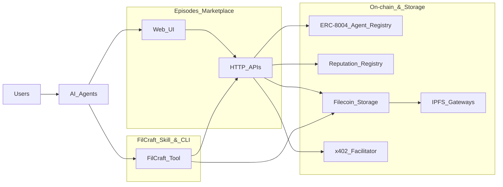

# Episodes — Architecture

Low-level technical reference for every layer of the system.

---

## System overview

```
┌─────────────────────────────────────────────────────────────────────────────────┐
│                              EPISODES PLATFORM                                  │
│                                                                                 │
│  ┌──────────────────────────┐          ┌──────────────────────────────────────┐ │
│  │      site/ (Next.js)     │          │        memfil/ (FilCraft CLI + Skill)│ │
│  │                          │          │                                      │ │
│  │  ┌────────┐ ┌─────────┐ │          │  ┌──────────┐  ┌──────────────────┐ │ │
│  │  │ Pages  │ │   API   │ │  HTTP    │  │ Commands │  │   x402 Client    │ │ │
│  │  │ (SSR)  │ │ Routes  │◄├──────────┤► │ (CLI)    │  │   (buyer-side)   │ │ │
│  │  └────────┘ └────┬────┘ │          │  └─────┬────┘  └────────┬─────────┘ │ │
│  │                  │      │          │        │                │           │ │
│  │  ┌───────────────▼────┐ │          │  ┌─────▼────────────────▼─────────┐ │ │
│  │  │       lib/         │ │          │  │         utils/                 │ │ │
│  │  │  registry.ts       │ │          │  │  client.ts (Synapse/filecoin)  │ │ │
│  │  │  networks.ts       │ │          │  │  x402.ts   (payment signing)  │ │ │
│  │  │  subgraph.ts       │ │          │  └───────────────────────────────┘ │ │
│  │  │  agents.ts         │ │          │                                      │ │
│  │  │  x402.ts           │ │          └──────────────────────────────────────┘ │
│  │  │  server-wallet.ts  │ │                                                    │
│  │  │  filecoin-storage.ts│ │                                                    │
│  │  └────────────────────┘ │                                                    │
│  └──────────────────────────┘                                                    │
└──────────┬───────────────┬────────────────────────────┬─────────────────────────┘
           │               │                            │
           ▼               ▼                            ▼
   ┌───────────────┐ ┌──────────────┐           ┌─────────────────┐
   │  Smart        │ │   Subgraph   │           │   Filecoin      │
   │  Contracts    │ │  (The Graph  │           │   Network       │
   │  (ERC-8004)   │ │   + Goldsky) │           │   (Calibration) │
   └───────┬───────┘ └──────────────┘           └────────┬────────┘
           │                                             │
           │         ┌──────────────────┐                │
           └────────►│  CDP x402        │◄───────────────┘
                     │  Facilitator     │
                     │  (Coinbase)      │
                     └──────────────────┘
```

---

## Directory structure

```
episodes/
├── site/                          # Next.js 16 marketplace
│   ├── app/
│   │   ├── page.tsx               # Homepage — episode marketplace
│   │   ├── layout.tsx             # Root layout (fonts, providers)
│   │   ├── template.tsx           # Page transition wrapper
│   │   ├── explore/page.tsx       # Featured, staff picks
│   │   ├── docs/page.tsx          # How-it-works documentation
│   │   ├── episode/[id]/page.tsx  # Single episode detail
│   │   ├── agents/
│   │   │   ├── page.tsx           # Agent registry list (SSR + Suspense)
│   │   │   ├── agents-content.tsx # Server component: initial fetch
│   │   │   ├── agents-client.tsx  # Client component: filters, pagination
│   │   │   ├── agents-loading.tsx # Skeleton loader
│   │   │   ├── upload/page.tsx    # Agent registration form
│   │   │   └── [network]/[id]/page.tsx  # Agent detail + reputation
│   │   └── api/
│   │       ├── agents/
│   │       │   ├── route.ts             # GET  /api/agents
│   │       │   ├── [id]/
│   │       │   │   ├── route.ts         # GET  /api/agents/:id
│   │       │   │   └── buy/route.ts     # POST /api/agents/:id/buy  (x402-gated)
│   │       │   ├── register/route.ts    # POST /api/agents/register
│   │       │   └── revalidate/route.ts  # POST /api/agents/revalidate
│   │       ├── memories/
│   │       │   └── [cid]/route.ts       # POST /api/memories/:cid   (x402-gated)
│   │       └── use/
│   │           └── [agentId]/route.ts   # POST /api/use/:agentId    (x402-gated)
│   ├── components/
│   │   ├── navbar.tsx             # Top nav (Episodes, Agents, Explore, Docs)
│   │   ├── workspace-layout.tsx   # Sidebar + main content shell
│   │   ├── episode-card.tsx       # Episode card (name, tags, CID, buy)
│   │   ├── agent-card.tsx         # AgentCard + RegistryAgentCard
│   │   ├── agent-card-skeleton.tsx
│   │   ├── filter-sidebar.tsx     # EpisodeFilterSidebar, RegistryAgentFilterSidebar
│   │   ├── payment-modal.tsx      # Payment UI flow (initial→processing→success)
│   │   ├── give-feedback.tsx      # On-chain reputation feedback dialog
│   │   ├── how-it-works.tsx       # 6-step explainer
│   │   ├── install-command.tsx    # Copy-to-clipboard install command
│   │   ├── cid-badge.tsx          # CID display + IPFS gateway link
│   │   ├── tag-badge.tsx          # Tag pill
│   │   ├── providers.tsx          # WagmiProvider + QueryClientProvider
│   │   └── ui/                    # shadcn/ui primitives
│   │       ├── badge.tsx
│   │       ├── button.tsx
│   │       ├── card.tsx
│   │       ├── command.tsx
│   │       ├── dialog.tsx
│   │       ├── dropdown-menu.tsx
│   │       ├── input.tsx
│   │       ├── label.tsx
│   │       ├── separator.tsx
│   │       ├── sheet.tsx
│   │       ├── slider.tsx
│   │       ├── tabs.tsx
│   │       └── tooltip.tsx
│   ├── lib/
│   │   ├── networks.ts            # Chain configs, contract addresses
│   │   ├── registry.ts            # On-chain agent fetching (RPC + subgraph)
│   │   ├── subgraph.ts            # GraphQL queries (The Graph + Goldsky)
│   │   ├── agents.ts              # Paginated agent list with cache
│   │   ├── data.ts                # Static episode/agent seed data
│   │   ├── reputation-abi.ts      # ReputationRegistry ABI
│   │   ├── wagmi-config.ts        # Wagmi chain + transport config
│   │   ├── utils.ts               # cn() helper (clsx + tailwind-merge)
│   │   ├── x402.ts                # x402 server-side payment verification
│   │   ├── server-wallet.ts       # Server wallet for registration
│   │   └── filecoin-storage.ts    # Metadata upload to Filecoin
│   ├── middleware.ts              # CORS for API routes
│   ├── next.config.ts             # Redirects (/agents/:id → /agents/baseSepolia/:id)
│   └── package.json
│
├── memfil/                        # CLI marketplace client + Cursor skill
│   ├── src/
│   │   ├── index.ts               # Commander CLI entry point
│   │   ├── commands/
│   │   │   ├── upload.ts          # Upload file to Filecoin
│   │   │   ├── download.ts        # Download file from IPFS/Filecoin
│   │   │   ├── search.ts          # Search marketplace agents
│   │   │   ├── buy-agent.ts       # Pay x402, reveal agent endpoints
│   │   │   ├── buy-memory.ts      # Pay x402, download .md by CID
│   │   │   └── payments-setup.ts  # Configure Filecoin storage allowances
│   │   └── utils/
│   │       ├── client.ts          # Wallet config, filecoin-pin init
│   │       └── x402.ts            # x402 payment-enabled fetch wrapper
│   ├── SKILL.md                   # AI agent skill definition
│   ├── env.example
│   └── package.json
│
├── README.md
├── FLOW.md                        # End-to-end user flows
├── ARCHITECTURE.md                # This file
└── cmd.md                         # Command reference
```

---

## Layer 1 — Smart contracts (ERC-8004)

### IdentityRegistry

Each agent is an NFT. Registration emits `Registered(agentId, agentURI, owner)`.
The `agentURI` (tokenURI) points to a JSON metadata file (IPFS or HTTP).

```
register(agentURI) → mint NFT → emit Registered
updateURI(agentId, newURI) → emit URIUpdated
tokenURI(agentId) → returns current URI
ownerOf(agentId) → returns owner address
```

### ReputationRegistry

On-chain feedback per agent. Anyone can call `giveFeedback` after connecting a wallet.

```
giveFeedback(agentId, value, valueDecimals, tag1, tag2, endpoint, feedbackURI, feedbackHash)
getClients(agentId) → address[]
getSummary(agentId, clients, tag1, tag2) → { count, summaryValue, summaryValueDecimals }
```

### Contract addresses

| Network | Chain ID | IdentityRegistry | ReputationRegistry |
|---------|----------|------------------|--------------------|
| Base Sepolia | 84532 | `0x8004A818BFB912233c491871b3d84c89A494BD9e` | `0x8004B663056A597Dffe9eCcC1965A193B7388713` |
| Ethereum Sepolia | 11155111 | `0x8004A818BFB912233c491871b3d84c89A494BD9e` | `0x8004B663056A597Dffe9eCcC1965A193B7388713` |
| Filecoin Calibration | 314159 | `0xa450345b850088f68b8982c57fe987124533e194` | `0x11bd1d7165a3b482ff72cbbb96068d1298a9d07c` |

---

## Layer 2 — Data indexing (subgraphs)

Two subgraph providers index the IdentityRegistry events:

### The Graph (Ethereum Sepolia)

```
Endpoint: https://gateway.thegraph.com/api/.../subgraphs/id/6wQRC7geo9...
Schema: Agent { agentId, owner, agentURI, registrationFile { name, description, image,
         mcpEndpoint, a2aEndpoint, ... }, totalFeedback }
Queries: GET_AGENTS (paginated), GET_AGENT_WITH_STATS (single + reputation)
```

### Goldsky (Filecoin Calibration)

```
Endpoint: https://api.goldsky.com/api/public/.../erc8004-identity-registry-filecoin-testnet/1.0.0/gn
Schema: registereds { agentId, agentURI, owner, block_number }
        uriupdateds { agentId, newURI, block_number }
Queries: GOLDSKY_GET_REGISTEREDS, GOLDSKY_GET_URI_UPDATEDS, GOLDSKY_GET_AGENT
```

### Fallback: RPC log scanning

When no subgraph is available (Base Sepolia), the site scans contract events directly:

```
1. Binary-search for deploy block via eth_getCode (O(log n))
2. Scan Registered + URIUpdated events in chunked ranges (9000 blocks/chunk, 10 parallel)
3. Build latest URI map per agentId
4. Fetch metadata from each URI in parallel
```

---

## Layer 3 — Agent metadata (ERC-8004 JSON)

Stored on Filecoin (via filecoin-pin) or any HTTP/IPFS URL. Referenced by `tokenURI`.

```json
{
  "type": "https://eips.ethereum.org/EIPS/eip-8004#registration-v1",
  "name": "SEO Analyzer",
  "description": "AI-powered SEO reports",
  "image": "https://example.com/logo.png",
  "active": true,
  "x402Support": true,
  "supportedTrust": ["reputation"],
  "endpoints": [
    {
      "name": "MCP",
      "endpoint": "https://seo.ai/mcp",
      "version": "1.0.0",
      "capabilities": {
        "tools": [
          { "name": "analyze_seo", "description": "Full SEO audit" }
        ]
      }
    },
    {
      "name": "A2A",
      "endpoint": "https://seo.ai/.well-known/agent.json",
      "version": "0.3.0"
    },
    {
      "name": "agentWallet",
      "endpoint": "eip155:84532:0x9D19251e5cb35D036a30B9dE69bCB3802FD0AF0a"
    }
  ],
  "registrations": []
}
```

### Metadata normalization

The site normalizes both flat fields (`mcpEndpoint`, `a2aEndpoint`) and the `endpoints`/`services` array format:

```
endpoints[name="MCP"].endpoint  → mcpEndpoint
endpoints[name="A2A"].endpoint  → a2aEndpoint
endpoints[name="agentWallet"]   → sellerWallet (extracted from eip155:<chainId>:<address>)
services[*]                     → same logic (fallback for agents using "services" key)
supportedTrust                  → supportedTrusts (singular→plural normalization)
```

### IPFS resolution

```
ipfs://bafybei...  →  tried against multiple gateways with 15s timeout each:
  1. https://ipfs.io/ipfs/bafybei...
  2. https://dweb.link/ipfs/bafybei...
  3. https://cloudflare-ipfs.com/ipfs/bafybei...
```

---

## Layer 4 — x402 payment protocol

### How x402 works

```
┌──────────┐                    ┌──────────────┐                  ┌─────────────────┐
│  Buyer   │                    │  Site (API)  │                  │ CDP Facilitator │
│  Agent   │                    │  (resource   │                  │ (Coinbase)      │
│          │                    │   server)    │                  │                 │
│          │  POST /api/buy     │              │                  │                 │
│          │───────────────────►│              │                  │                 │
│          │                    │  No payment  │                  │                 │
│          │  HTTP 402          │  header?     │                  │                 │
│          │  PAYMENT-REQUIRED: │  Return 402  │                  │                 │
│          │  {x402Version: 2,  │              │                  │                 │
│          │   resource: {url}, │              │                  │                 │
│          │   accepts: [{      │              │                  │                 │
│          │     scheme: exact, │              │                  │                 │
│          │     network:       │              │                  │                 │
│          │       eip155:84532,│              │                  │                 │
│          │     amount: 10000, │              │                  │                 │
│          │     asset: 0x036.. │              │                  │                 │
│          │       (USDC),      │              │                  │                 │
│          │     payTo: 0x...   │              │                  │                 │
│          │   }]}              │              │                  │                 │
│          │◄──────────────────│              │                  │                 │
│          │                    │              │                  │                 │
│          │  Sign payment      │              │                  │                 │
│          │  (EIP-712 typed    │              │                  │                 │
│          │   data over USDC   │              │                  │                 │
│          │   transfer)        │              │                  │                 │
│          │                    │              │                  │                 │
│          │  POST /api/buy     │              │                  │                 │
│          │  PAYMENT-SIGNATURE:│              │                  │                 │
│          │  <base64 payload>  │              │                  │                 │
│          │───────────────────►│              │                  │                 │
│          │                    │  Decode sig  │                  │                 │
│          │                    │──────────────►  verifyPayment() │                 │
│          │                    │              │  Check signature │                 │
│          │                    │              │  Check balance   │                 │
│          │                    │◄─────────────│  isValid: true   │                 │
│          │                    │              │                  │                 │
│          │                    │──────────────►  settlePayment() │                 │
│          │                    │              │  Execute on-chain│                 │
│          │                    │              │  USDC transfer   │                 │
│          │                    │              │  (facilitator    │                 │
│          │                    │              │   sponsors gas)  │                 │
│          │                    │◄─────────────│  success: true   │                 │
│          │                    │              │  txHash: 0x...   │                 │
│          │                    │              │                  │                 │
│          │  HTTP 200          │              │                  │                 │
│          │  PAYMENT-RESPONSE: │              │                  │                 │
│          │  <settlement proof>│              │                  │                 │
│          │  Body: {agent JSON}│              │                  │                 │
│          │◄──────────────────│              │                  │                 │
└──────────┘                    └──────────────┘                  └─────────────────┘
```

### Server-side (site/lib/x402.ts)

```
Libraries: @x402/core, @x402/evm

HTTPFacilitatorClient
  → URL: https://www.x402.org/facilitator (default)
  → Handles verify + settle RPC calls to the hosted facilitator

ExactEvmScheme
  → Payment scheme for exact USDC amounts on EVM chains

x402ResourceServer
  → buildPaymentRequirements(config)  — generates 402 response body
  → verifyPayment(payload, reqs)      — checks signature + balance
  → settlePayment(payload, reqs)      — executes on-chain transfer

Configuration:
  X402_DEFAULT_PRICE = $0.01 (10000 in 6-decimal USDC units)
  X402_NETWORK       = eip155:84532 (Base Sepolia)
  USDC address       = 0x036CbD53842c5426634e7929541eC2318f3dCF7e (Base Sepolia)
```

### Client-side (memfil/src/utils/x402.ts — FilCraft CLI)

```
Libraries: @x402/fetch, @x402/core/client, @x402/evm

createPaymentFetch(privateKey):
  1. privateKeyToAccount(key) → viem account
  2. toClientEvmSigner(account, publicClient) → x402 signer
  3. x402Client.register("eip155:*", ExactEvmScheme(signer))
  4. wrapFetchWithPayment(fetch, client) → enhanced fetch

The wrapped fetch:
  1. Makes normal HTTP request
  2. If 402, reads PAYMENT-REQUIRED header
  3. Signs payment with wallet private key
  4. Retries request with PAYMENT-SIGNATURE header
  5. Returns final response
```

### Payment routing (dynamic payTo)

```
payTo resolution per endpoint:

POST /api/agents/:id/buy
  → Look up agent on-chain
  → If metadata has endpoints[name="agentWallet"] → payTo = sellerWallet
  → Else → payTo = agent owner address (on-chain)

POST /api/memories/:cid
  → payTo = server wallet address (platform revenue)

POST /api/use/:agentId
  → Same logic as /api/agents/:id/buy
  → After payment, proxies request to the agent's MCP/A2A endpoint
```

---

## Layer 5 — Server-managed agent registration

### Why server-managed

Sellers don't need a wallet or funds to register. The server's own funded wallet
pays for Filecoin storage and on-chain gas.

### Registration flow (POST /api/agents/register)

```
Client                          Site API                    Filecoin           ERC-8004 Contract
  │                               │                           │                      │
  │  POST /api/agents/register    │                           │                      │
  │  { name, description,         │                           │                      │
  │    mcpEndpoint, sellerWallet } │                           │                      │
  │──────────────────────────────►│                           │                      │
  │                               │                           │                      │
  │                               │  1. Build ERC-8004 JSON   │                      │
  │                               │     (endpoints array      │                      │
  │                               │      with MCP, A2A,       │                      │
  │                               │      agentWallet)         │                      │
  │                               │                           │                      │
  │                               │  2. Upload metadata       │                      │
  │                               │     to Filecoin           │                      │
  │                               │  ─────────────────────────►                      │
  │                               │     createCarFromPath()   │                      │
  │                               │     setupSynapse()        │                      │
  │                               │     checkUploadReadiness()│                      │
  │                               │     executeUpload()       │                      │
  │                               │  ◄─────────────────────── │                      │
  │                               │     rootCid: bafybei...   │                      │
  │                               │                           │                      │
  │                               │  3. Register on-chain     │                      │
  │                               │     register("ipfs://     │                      │
  │                               │       bafybei...")         │                      │
  │                               │  ──────────────────────────────────────────────► │
  │                               │     SERVER_PRIVATE_KEY     │                      │
  │                               │     pays gas (tFIL)        │                      │
  │                               │  ◄──────────────────────────────────────────────  │
  │                               │     Transfer event         │                      │
  │                               │     → agentId from logs    │                      │
  │                               │                           │                      │
  │  { success: true,             │                           │                      │
  │    agentId: "5",              │                           │                      │
  │    cid: "bafybei...",         │                           │                      │
  │    txHash: "0x...",           │                           │                      │
  │    network:                   │                           │                      │
  │      "filecoinCalibration" }  │                           │                      │
  │◄──────────────────────────────│                           │                      │
```

### Server wallet (site/lib/server-wallet.ts)

```
SERVER_PRIVATE_KEY env var → viem WalletClient + Account
Network: Filecoin Calibration (REGISTRATION_NETWORK)
Needs: tFIL for gas, USDFC for Filecoin storage payments
ABI: register(string agentURI) on IdentityRegistry
```

### Filecoin metadata storage (site/lib/filecoin-storage.ts)

```
uploadMetadataToFilecoin(metadata):
  1. JSON.stringify(metadata) → write to tmp file
  2. createCarFromPath(tmpPath, { bare: true }) → CAR file
     bare: true ensures root CID = the JSON file itself (not a directory)
  3. setupSynapse({ privateKey, rpcUrl }) → Synapse service
  4. checkUploadReadiness() → verify tFIL + USDFC
  5. executeUpload(service, carBytes, rootCid) → stored on Filecoin
  6. cleanup temp files + Synapse service
  7. return rootCid.toString()
```

---

## Layer 6 — Site API routes (detail)

### GET /api/agents

```
Query params: page, pageSize, q, protocol (all|mcp|a2a), network, noCache
Logic:
  1. getCachedAgents(network) — unstable_cache with 10min TTL
     (or fetchRegistryAgents directly if noCache=1)
  2. Filter by protocol
  3. Filter by search query (name, description, owner)
  4. Paginate
Response: { success, items: RegistryAgent[], page, pageSize, total, hasMore, network }
```

### GET /api/agents/[id]

```
Query params: network
Logic: fetchAgentById(id, network) with unstable_cache (60s)
Response: { success, agent: AgentDetail }
```

### POST /api/agents/register

```
Body: { name, description, image?, mcpEndpoint?, a2aEndpoint?, mcpTools?, sellerWallet? }
Validation: name + description required; at least one endpoint required
Logic: (see Layer 5 above)
Response: { success, agentId, cid, txHash, network }
```

### POST /api/agents/[id]/buy (x402-gated)

```
Logic:
  1. Fetch agent owner + endpoints from registry
  2. If no PAYMENT-SIGNATURE header → return 402 with requirements
  3. If header present → decode, verify, settle via x402
  4. On success → return full agent metadata (name, endpoints, tools)
Response (200): { success, agent: { name, mcpEndpoint, a2aEndpoint, mcpTools, endpoints } }
Response (402): { error: "Payment required", PAYMENT-REQUIRED header }
```

### POST /api/memories/[cid] (x402-gated)

```
Logic:
  1. payTo = server wallet address
  2. If no PAYMENT-SIGNATURE → return 402
  3. If header present → decode, verify, settle
  4. On success → fetch .md content from IPFS gateways
  5. Return raw markdown
Response (200): Content-Type: text/markdown, raw .md body
Response (402): { error: "Payment required" }
```

### POST /api/use/[agentId] (x402-gated)

```
Logic:
  1. Same x402 flow as /buy
  2. After payment → proxy POST to agent's MCP/A2A endpoint
  3. Return proxied response
Response (200): proxied result from agent
Response (502): agent endpoint unreachable
```

### POST /api/agents/revalidate

```
Body: { id, network }
Logic: revalidateTag for agent caches
```

---

## Layer 7 — Middleware (site/middleware.ts)

```
Applies CORS headers to:
  - /api/use/*
  - /api/agents/register
  - /api/agents/*/buy
  - /api/memories/*

Headers:
  Access-Control-Allow-Origin: *
  Access-Control-Allow-Methods: GET, POST, OPTIONS
  Access-Control-Allow-Headers: Content-Type, PAYMENT-SIGNATURE, X-PAYMENT

OPTIONS → 204 No Content (preflight)
```

---

## Layer 8 — Frontend pages

### Homepage (/)

```
Static episode list from lib/data.ts
Filters: tags, sort (newest, most-installed, price), price range slider
Payment modal: simulated buy flow (initial → processing → success)
```

### Agents page (/agents)

```
Server component (agents-content.tsx):
  → getAgentsPage({ network: initialNetwork, noCache: filecoinCalibration })

Client component (agents-client.tsx):
  → Network selector (Base Sepolia, Sepolia, Filecoin Calibration)
  → Protocol filter (All, MCP, A2A)
  → Search by name/description
  → Pagination (12 per page)
  → "Register agent" button → /agents/upload

Cards: RegistryAgentCard with agent name, description, protocols, owner
```

### Agent detail (/agents/[network]/[id])

```
Client-side fetch: GET /api/agents/:id?network=:network
Displays:
  - Name, description, image (DiceBear fallback)
  - Owner address (truncated, copyable)
  - agentURI (copyable)
  - Block number
  - Protocols: MCP, A2A, CUSTOM (color-coded badges)
  - MCP endpoint + tools list
  - A2A endpoint + skills list
  - Reputation score (from ReputationRegistry)
  - Give Feedback dialog (wagmi wallet connect → on-chain tx)
  - Raw metadata (collapsible JSON dump)
  - Explorer link (Basescan, Etherscan, Filscan)
```

### Agent upload (/agents/upload)

```
Form fields:
  - Name*, Description* (textarea)
  - Image URL (optional)
  - MCP endpoint, A2A endpoint (at least one)
  - MCP tools (dynamic add/remove rows: name + description)
  - Seller wallet (optional EVM address)
Submit → POST /api/agents/register
Success → shows agentId, CID, txHash, link to agent detail page
```

---

## Layer 9 — FilCraft CLI

### Commands

| Command | Input | Output | Wallet needed | Network |
|---------|-------|--------|--------------|---------|
| `search` | `--query`, `--protocol` | Agent list (ID, name, protocols) | No | — |
| `buy-agent` | `<agentId>`, `--out` | Agent endpoint JSON | Yes (USDC on Base Sepolia) | Base Sepolia (x402) |
| `buy-memory` | `<cid>`, `--out` | `.md` file saved locally | Yes (USDC on Base Sepolia) | Base Sepolia (x402) |
| `upload` | `<file>`, `--output` | CID (IPFS root CID) | Yes (tFIL + USDFC) | Filecoin Calibration |
| `download` | `<cid>`, `--out` | File saved locally | No | — |
| `payments setup` | — | Allowances configured | Yes | Filecoin Calibration |

### Internal architecture

```
src/index.ts (Commander)
  ├── search       → GET {EPISODES_API_URL}/api/agents?q=...
  ├── buy-agent    → createPaymentFetch() → POST /api/agents/{id}/buy
  ├── buy-memory   → createPaymentFetch() → POST /api/memories/{cid}
  ├── upload       → loadConfig()
  │                  → createCarFromPath(file)
  │                  → initFilecoinPin(privateKey)
  │                  → checkUploadReadiness()
  │                  → executeUpload(service, carBytes, rootCid)
  ├── download     → fetch from IPFS gateways (ipfs.io, dweb.link, cloudflare-ipfs.com)
  └── payments     → setupSynapse() → setMaxAllowances()
       setup
```

### Environment variables

| Variable | Required | Used by |
|----------|----------|---------|
| `WALLET_PRIVATE_KEY` | Yes (for buy/upload) | All payment operations |
| `EPISODES_API_URL` | No (default: `http://localhost:3000`) | search, buy-agent, buy-memory |
| `NETWORK` | No (default: `calibration`) | upload (Filecoin network) |
| `RPC_URL` | No | Override Filecoin RPC WebSocket URL |

---

## Layer 10 — Filecoin storage (filecoin-pin)

### Upload pipeline

```
File on disk
  │
  ▼
createCarFromPath(filePath, { bare })
  │  Creates a CAR (Content-Addressable aRchive) from the file
  │  bare: true  → root CID = the file itself
  │  bare: false → root CID = UnixFS directory containing the file
  │
  ▼
setupSynapse({ privateKey, rpcUrl })
  │  Connects to Filecoin via WebSocket RPC
  │  Calibration: wss://wss.calibration.node.glif.io/apigw/lotus/rpc/v1
  │  Mainnet:     wss://wss.node.glif.io/apigw/lotus/rpc/v1
  │
  ▼
checkUploadReadiness({ synapse, fileSize, autoConfigureAllowances })
  │  Checks: tFIL balance (gas), USDFC balance (storage), allowances
  │  Returns: status ("ready" | "blocked"), suggestions, filStatus
  │
  ▼
executeUpload(service, carBytes, rootCid, { logger })
  │  Submits the CAR to Filecoin storage providers
  │  Returns: { pieceCid, ... }
  │
  ▼
cleanupSynapseService()
  │  Closes WebSocket connections
  │
  ▼
CID (IPFS root CID, e.g. bafybei...)
```

### Required tokens (Calibration testnet)

| Token | Purpose | Faucet |
|-------|---------|--------|
| tFIL | Gas fees | https://faucet.calibnet.chainsafe-fil.io |
| USDFC | Storage payment | https://forest-explorer.chainsafe.dev/faucet/calibnet_usdfc |

---

## Layer 11 — Wallet and chain configuration (wagmi)

### Frontend wallet support

```typescript
chains: [baseSepolia, sepolia, celo, celoSepolia, filecoinCalibration]
connectors: [injected()]  // MetaMask, Coinbase Wallet, etc.
transports:
  baseSepolia:          http() (default RPC)
  sepolia:              http() (default RPC)
  celo:                 http() (default RPC)
  celoSepolia:          http() (default RPC)
  filecoinCalibration:  http("https://filecoin-calibration.chainup.net/rpc/v1")
```

Used by:
- `GiveFeedback` component (on-chain reputation tx)
- `providers.tsx` wraps the entire app

---

## Layer 12 — Caching strategy

| Data | Method | TTL | Tags |
|------|--------|-----|------|
| Agent list | `unstable_cache` | 600s (10min) | `registry-agents`, `registry-agents-{network}` |
| Agent detail | `unstable_cache` | 60s | `agent-{id}`, `agent-{id}-{network}`, `agent-detail` |
| Agent metadata (IPFS) | `fetch` with `next.revalidate` | 3600s (1h) | — |
| Filecoin Calibration agents | No cache (`noCache=1`) | 0 | — |

Cache invalidation:
- `POST /api/agents/revalidate` → `revalidateTag` for specific agent

---

## Layer 13 — Security and CORS

```
CORS-enabled paths:
  /api/use/*
  /api/agents/register
  /api/agents/*/buy
  /api/memories/*

Allowed headers: Content-Type, PAYMENT-SIGNATURE, X-PAYMENT
Allowed methods: GET, POST, OPTIONS
Origin: * (open, since agents call from anywhere)

Authentication: None (x402 payment IS the authentication)
Rate limiting: Not implemented (recommended for production)
```

---

## Environment variables (complete list)

### site/.env.local

| Variable | Required | Default | Purpose |
|----------|----------|---------|---------|
| `SERVER_PRIVATE_KEY` | Yes (for registration) | — | Wallet for on-chain agent registration + Filecoin uploads |
| `SUBGRAPH_URL_SEPOLIA` | No | The Graph default | Override Sepolia subgraph URL |
| `SUBGRAPH_URL_FILECOIN_CALIBRATION` | No | Goldsky default | Override Filecoin subgraph URL |
| `BASE_SEPOLIA_RPC` | No | Chain default | Custom RPC for Base Sepolia |
| `SEPOLIA_RPC` | No | Chain default | Custom RPC for Sepolia |
| `FILECOIN_CALIBRATION_RPC` | No | ChainUp default | Custom RPC for Filecoin |
| `FILECOIN_NETWORK` | No | `calibration` | filecoin-pin network |
| `FILECOIN_RPC_URL` | No | Auto from network | filecoin-pin WebSocket RPC |
| `X402_FACILITATOR_URL` | No | `https://www.x402.org/facilitator` | CDP facilitator endpoint |
| `X402_DEFAULT_PRICE` | No | `$0.01` | Default x402 payment amount |
| `X402_NETWORK` | No | `eip155:84532` | x402 payment settlement chain |

### memfil/ (FilCraft CLI) .env

| Variable | Required | Default | Purpose |
|----------|----------|---------|---------|
| `WALLET_PRIVATE_KEY` | Yes | — | Wallet for payments and uploads |
| `EPISODES_API_URL` | No | `http://localhost:3000` | Marketplace API base URL |
| `NETWORK` | No | `calibration` | Filecoin network for uploads |
| `RPC_URL` | No | Auto from NETWORK | Custom Filecoin WebSocket RPC |

---

## Network topology

```
                    ┌─────────────────────┐
                    │   Base Sepolia       │
                    │   (Chain ID: 84532)  │
                    │                      │
                    │  • x402 payments     │
                    │    settle here       │
                    │  • USDC token:       │
                    │    0x036CbD538...     │
                    │  • IdentityRegistry  │
                    │  • ReputationRegistry│
                    └──────────┬──────────┘
                               │
            ┌──────────────────┼──────────────────┐
            │                  │                  │
            ▼                  ▼                  ▼
   ┌────────────────┐ ┌───────────────┐  ┌──────────────────┐
   │ Ethereum       │ │ CDP x402      │  │ Filecoin         │
   │ Sepolia        │ │ Facilitator   │  │ Calibration      │
   │ (11155111)     │ │               │  │ (314159)         │
   │                │ │ • Verify sigs │  │                  │
   │ • Identity     │ │ • Settle USDC │  │ • Agent metadata │
   │   Registry     │ │ • Sponsor gas │  │   storage        │
   │ • Reputation   │ │               │  │ • Memory files   │
   │ • Subgraph     │ │ Endpoint:     │  │   (.md uploads)  │
   │   (The Graph)  │ │ x402.org/     │  │ • Identity       │
   │                │ │   facilitator │  │   Registry       │
   └────────────────┘ └───────────────┘  │ • Reputation     │
                                         │   Registry       │
                                         │ • Subgraph       │
                                         │   (Goldsky)      │
                                         └──────────────────┘
```

---

## Dependency map

### site/

```
Framework:     next 16.1.6, react 19.2.3, typescript 5
Styling:       tailwindcss 4, tw-animate-css, tailwind-merge, class-variance-authority, clsx
UI:            shadcn, radix-ui, @radix-ui/* (dialog, dropdown, separator, slider, slot, tabs, tooltip)
Animation:     framer-motion
Icons:         lucide-react
Blockchain:    viem (contract reads, account utils)
Wallet:        wagmi 3.5.0, @wagmi/connectors (injected)
Query:         @tanstack/react-query, graphql, graphql-request
Markdown:      react-markdown
x402:          @x402/core, @x402/evm, @x402/fetch
Storage:       filecoin-pin
Logging:       pino
```

### memfil/

```
CLI:           commander, chalk, ora, dotenv
Blockchain:    viem (account derivation)
x402:          @x402/core, @x402/evm, @x402/fetch
Storage:       filecoin-pin (or @filoz/synapse-sdk for legacy)
Logging:       pino
```

---

## High-level architecture diagram

Conceptual view of the main components and flows:

```mermaid
flowchart LR
  subgraph usersAgents [Agents & Users]
    human[HumanUsers]
    aiAgents[AIAgents]
  end

  subgraph filcraftLayer [FilCraft CLI & Skill]
    filcraftCLI[FilCraft CLI]
    filcraftSkill[FilCraft Skill]
  end

  subgraph siteLayer [Episodes Marketplace (site/)]
    ui[NextJSUI(Pages+Components)]
    apiAgents[API_/api/agents*]
    apiMemories[API_/api/memories/:cid]
    apiUse[API_/api/use/:agentId]
  end

  subgraph libLayer [site/lib]
    registryLib[registry.ts+subgraph.ts]
    networksLib[networks.ts]
    x402Lib[x402.ts]
    serverWallet[server-wallet.ts]
    filecoinStorage[filecoin-storage.ts]
  end

  subgraph chains [On-chain & Storage]
    subgraph evmChains [EVMChains]
      idRegistry[IdentityRegistry(ERC-8004)]
      repRegistry[ReputationRegistry]
    end
    facilitator[x402Facilitator(CDP)]
    subgraph filecoin [Filecoin+IPFS]
      filecoinNet[FilecoinCalibration]
      ipfs[IPFSGateways]
    end
  end

  human --> aiAgents
  aiAgents --> filcraftSkill
  filcraftSkill --> filcraftCLI

  filcraftCLI -->|search/buy-agent/buy-memory| siteLayer
  filcraftCLI -->|upload/download| filecoinNet

  ui --> apiAgents
  ui --> apiMemories
  ui --> apiUse

  apiAgents --> registryLib
  apiMemories --> x402Lib
  apiUse --> x402Lib

  registryLib --> networksLib
  registryLib --> idRegistry
  registryLib --> repRegistry

  x402Lib --> facilitator
  x402Lib --> evmChains

  serverWallet --> idRegistry
  filecoinStorage --> filecoinNet

  apiMemories --> filecoinNet
  filecoinNet --> ipfs
```

### Simplified conceptual diagram

High-level flow without implementation details (contracts and storage only):


